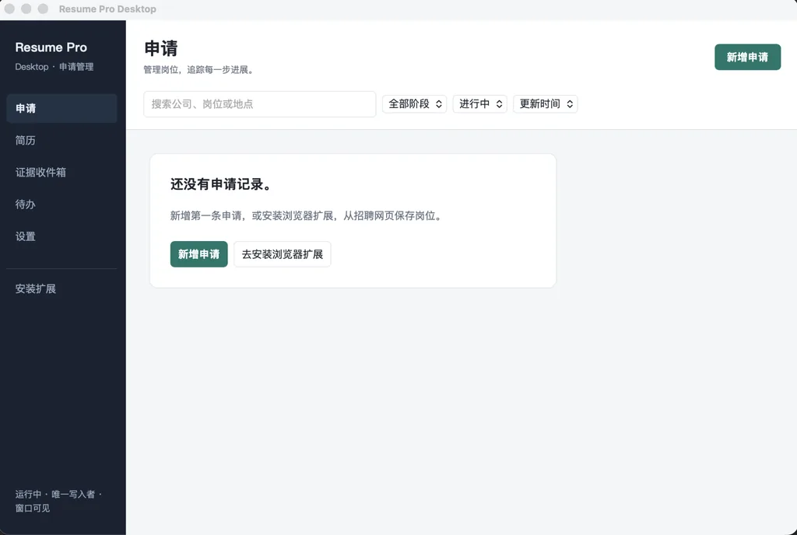

# 网申快填

**少填重复信息，集中管理求职进度。**

网申快填是一款免费、开源的本地优先求职助手，由 **桌面应用 + 浏览器扩展** 组成：在招聘网站辅助填写网申，在电脑上集中管理简历、岗位、申请进度和相关材料。

准备好简历，在不同网站重复使用；看到合适的岗位，确认后保存；提交申请后，记录进度、整理通知，再安排下一步。

**[🧩 Chrome 商店安装插件](https://chromewebstore.google.com/detail/diagjmploldedipjdenmecmjokckelkl)** · **[🖥️ 桌面应用下载](https://19991107.xyz/tools/wangshen-kuaitian/download/)** · **[📖 快速开始](#快速开始)** · **[💬 QQ 交流群](#-qq-交流群)** · **[🐛 提交问题](https://github.com/TshyGO/resume-form-assistant-plugin/issues)**

> **优先从商店安装扩展。** 商店审核和更新分发可能晚于 GitHub 发布。如果商店版本落后于发布页的配套插件，或出现版本不兼容提示，请从[正式版下载页](https://19991107.xyz/tools/wangshen-kuaitian/download/)下载配套插件 ZIP，按[手动安装说明](#手动安装扩展)加载。

## 💬 QQ 交流群

> ### **QQ群：`1121142517`**
>
> 最近使用的人比较多，很多问题其实都是共性的。遇到安装、AI 接口配置、网申网站兼容性等问题，可以进群一起讨论，也可以参考其他人的使用经验。
>
> 🧩 **安装配置**　🤖 **AI 接口**　🌐 **网站兼容**　🚀 **版本更新**　💡 **功能建议**　🎓 **秋招交流**

如果确认是 Bug，建议同时在 [GitHub Issues](https://github.com/TshyGO/resume-form-assistant-plugin/issues) 提交，方便后续跟踪和修复。

> ⚠️ **隐私提醒：** 请不要在群里发送自己的 API Key、身份证号、手机号等敏感信息，截图前记得打码。

## 界面预览

*桌面「申请」页的空状态示例。截图中仍显示旧名称 Resume Pro / Resume Pro Desktop，项目现名为「网申快填」。*

## 可以用它做什么

| 你的需求 | 对应功能 |
| --- | --- |
| 不想每到一个网站就重新填写简历 | AI 辅助匹配网申字段；未填好的文本字段可点击补填、添加或替换 |
| 不同岗位需要不同版本的简历 | 保存多套模板，统一维护「我的信息」；Excel / CSV 导入导出，AI 解析 PDF / DOCX / TXT 简历 |
| 想知道投了哪些公司、进展到哪一步 | 保存岗位，记录投递、测评、面试、Offer 等阶段，查看申请时间线 |
| 想回看某次填写用的简历版本 | 主动保存填写记录，并可附带填写开始时的简历模板快照 |
| 招聘邮件、截图和通知散落各处 | 在「证据收件箱」导入文件或文本，关联申请；可选用 AI 整理内容，再由你确认 |
| 想安排下一步并保留自己的资料 | 创建与申请关联的待办，设置到期时间，导出和恢复本地档案备份 |

**桌面端负责资料和进度，扩展负责网页上的填写与保存入口。** 简历模板、「我的信息」和 AI 设置统一在桌面维护。网页填写需要两者配合，桌面不可用时，简历字段与 AI 填写也不可用。

软件免费。AI 功能需要自行配置兼容接口，模型费用由服务商决定。**不配置 AI，仍可导入 Excel 模板、点击字段填写和管理本地岗位记录。**

## 下载与安装

| 组件 | 支持范围 | 获取方式 |
| --- | --- | --- |
| Windows 桌面应用 | Windows x64 | [正式版下载页](https://19991107.xyz/tools/wangshen-kuaitian/download/)，下载 `wangshen-kuaitian_<版本>_x64-setup.exe` |
| macOS 桌面应用 | Apple Silicon（Apple 芯片） | 同一发布页，下载 `wangshen-kuaitian_<版本>_aarch64.dmg` |
| 浏览器扩展 | Chrome / Edge 116 或更新版本 | 优先从 [Chrome 商店](https://chromewebstore.google.com/detail/diagjmploldedipjdenmecmjokckelkl)安装；商店不可用或版本尚未同步时使用配套 ZIP |

**[固定下载入口](https://19991107.xyz/tools/wangshen-kuaitian/download/)会自动查询最新桌面正式版及其配套插件，后续发版无需更换网址。** 查询失败时可使用页面中的 GitHub 发布列表备用入口。商店审核和分发可能滞后，商店版不保证是最新配套版本。

桌面端的正式发布标签为 `desktop-vX.Y.Z`。**同一发布页提供桌面安装包和配套插件 ZIP**，扩展文件名为 `wangshen-kuaitian-plugin-<版本>.zip`。桌面与扩展独立发版，版本号不要求完全相同，请按发布说明选择配套版本。

安装包尚无商业代码签名，首次启动可能遇到系统提示。请确认下载来源，并参考[安装与升级说明](docs/desktop-mvp/install-and-update.md#2-安装包没有签名)，不要关闭系统安全保护。

## 快速开始

普通使用不需要会代码，不需要安装 Python、Node.js 或 Rust，也不需要自己编译。

### 1. 安装并连接

安装适合自己系统的桌面应用，**至少打开一次**。随后优先从商店安装浏览器扩展，建议固定到工具栏。

安装后重启一次浏览器，点击工具栏中的网申快填图标，打开侧边栏。若提示未连接，到桌面「设置 → 浏览器连接」检查；只有界面提示需要配对时，才复制扩展 ID 并完成配对。

#### 手动安装扩展

商店访问有问题、版本尚未同步或提示不兼容时，从桌面端发布页下载配套插件 ZIP：

1. 解压到一个固定文件夹，之后不要删除或移动它。
2. 打开 `chrome://extensions` 或 `edge://extensions`，开启「开发者模式」。
3. 点击「加载已解压的扩展程序」，选中能直接看到 `manifest.json` 的文件夹，然后重启浏览器。

**已有旧数据的用户，不要为了切换安装方式直接卸载旧扩展或清除浏览器数据。** 先按[旧版升级说明](#从旧版升级)完成迁移或取回资料。

### 2. 准备自己的简历

在桌面「简历」页导入 Excel / CSV 模板，前三列依次为「一级分类」「字段名」「值」，第二列不要留空。

| 一级分类 | 字段名 | 值 |
| --- | --- | --- |
| 基本信息 | 姓名 | 张三 |
| 基本信息 | 邮箱 | example@example.com |
| 教育背景 | 学校 | 示例大学 |
| 教育背景 | 专业 | 材料科学与工程 |

也可以先完成下一步的 AI 配置，再导入 PDF、DOCX 或 TXT 简历，由 AI 生成模板。生成后请核对内容；扫描件或无法提取文字的 PDF，需要先准备可提取文字的版本。

在「我的信息」中补充籍贯、户口等网申常用资料。不同岗位可以使用不同模板，填写前切换「当前模板」即可。

### 3. 选择是否使用 AI

**不用 AI：** 导入 Excel 后，在网页里点击输入框，再点击侧边栏的对应字段即可辅助填写；本地岗位管理也可使用。

**使用 AI：** 在桌面「设置 → AI 设置」添加服务商，填写接口地址、API Key 和模型，设为「当前使用」。接口需兼容 OpenAI Chat Completions，支持配置多个服务商。软件不赠送模型额度，也不代办服务商账号。

配置方式与常见错误见[使用指南](docs/user-guide.md#ai-配置)。

### 4. 填写网申并自行提交

打开招聘网站的网申表单，在侧边栏选择当前模板，点击「一键 AI 填写」。安装扩展前已经打开的网页，需要刷新一次。

检查结果；未填好的文本字段，先点击网页输入框，再从侧边栏点击字段补填。已有内容时，可使用「添加」「替换」「删除」调整。

**请重点核对日期、学历、地区、复杂下拉框和多段经历。确认无误后，由你在招聘网站提交。插件不会替你提交网申。**

### 5. 保存岗位，记录后续进度

在侧边栏点击「保存岗位到桌面端」，核对公司和岗位后保存。网站提交完成后，可用「确认已投递」选择对应申请，更新本地阶段。

需要回看本次使用的简历时，选择保存填写记录及可选快照。之后在桌面查看时间线、导入通知材料，并安排待办。

## 能力范围

普通输入框、文本框、下拉框、单选框，以及部分日期和级联控件已有适配；高度定制的招聘系统仍可能需要手动处理。不承诺所有网站都能完整自动填写。

「AI 辅助新增条目」是可选实验功能，只对部分结构明确的论文或经历分组生效，需要预览并确认计划。适用范围和停止行为见[详细说明](docs/user-guide.md#ai-辅助新增条目)。

**填写留档不等于成功投递。** 留档保存填写结果摘要及可选的简历模板快照，不能证明招聘网站最终收到的内容。「确认已投递」只更新本地记录。

「证据收件箱」处理你主动导入的文件或文本，不会自动登录邮箱收信。待办系统提醒取决于系统权限、应用运行状态和平台能力，请以应用内显示为准；重要测评、面试不要只依赖本工具提醒。

## 隐私与数据

简历、申请记录、附件和待办保存在你电脑上的桌面档案中，不上传到作者服务器。API Key 保存在系统凭据库，不进入桌面档案备份。

**本地保存不等于 AI 全程离线。** 使用 AI 功能时，相关表单信息、简历内容或通知正文会发送给你自行配置的服务商。PDF / DOCX 在本机提取文字后，用于 AI 解析的文字仍会发送给服务商。

扩展在旧版迁移完成后不再长期保存普通简历模板或 API Key；未完成迁移的数据、待同步记录与快照暂存有相应处理规则。完整数据流与权限说明见[隐私政策](docs/privacy-policy.md)。请定期备份重要资料，勿在群聊或公开 Issue 中发送 API Key、完整简历或未打码截图。

## 从旧版升级

**0.4.0 及更早的独立插件用户：** 先安装桌面并连接，再在桌面「简历」页确认导入旧模板、「我的信息」和 AI 配置。未确认前不要卸载旧扩展或清除数据；未能迁移的内容可在插件状态页取回。具体步骤见[迁移说明](docs/user-guide.md#旧版数据迁移)。

**Resume Pro Desktop 测试版用户：** 更名涉及安装位置，请按[改名升级说明](docs/desktop-mvp/install-and-update.md#52-从-resume-pro-desktop-测试版升级到网申快填)操作。

**后续常规更新：** 商店版扩展通过商店更新；手动加载的扩展需更新原文件夹并重新加载。桌面应用可以检查更新，下载和安装由你完成。

## 常见问题

**连不上桌面或提示没配置 AI？** 先看桌面连接状态，再确认 AI 服务商已设为「当前使用」。商店版本尚未同步时，按上面的说明使用配套 ZIP。

**Excel 导入失败、接口报错、某个字段填不上？** 详见[使用指南与排错](docs/user-guide.md#常见问题)，其中保留了模板格式、手动补填、诊断和高级使用说明。

**需要反馈问题？** 请提供桌面与扩展版本、系统和浏览器、招聘网站名称、出问题的字段，以及打码后的截图或诊断摘要。使用交流可以进上方 QQ 群，可复现的 Bug 建议同时提交 [Issue](https://github.com/TshyGO/resume-form-assistant-plugin/issues/new/choose)。网站填不上或填错时，选「网站填不上 / 填错」模板，并附上侧栏「填写诊断」里「复制诊断」得到的文字。

## 开发与贡献

扩展源码位于仓库根目录，桌面端源码位于 `desktop/`。扩展可直接加载源码；桌面端需要单独的开发环境与构建流程。

[开发快速开始](docs/dev-quickstart.md) · [扩展架构与调试](docs/extension-development.md) · [桌面端开发说明](desktop/README.md) · [构建与安装](docs/desktop-mvp/install-and-update.md) · [发版 SOP](docs/release-sop.md)

## License

[MIT License](LICENSE)。欢迎反馈问题、贡献适配和改进文档。这个工具对你有帮助的话，也欢迎点一个 Star。
