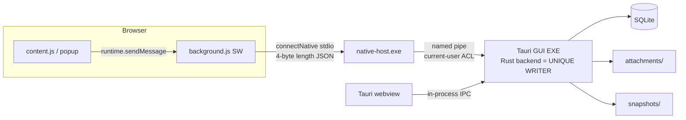
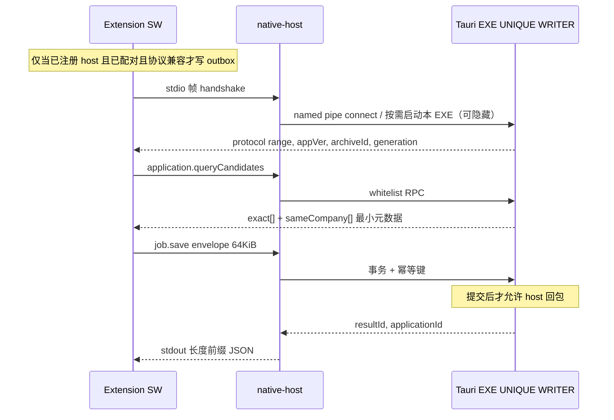

# ADR：Windows 桌面主程序架构与技术选型

| 字段 | 值 |
| --- | --- |
| 标题 | ADR-001 桌面栈、进程模型与通信原则 |
| 作者 | D01 design PR |
| 日期 | 2026-09-06 |
| 状态 | Draft / Ready for review |
| 上级 | [README.md](README.md) · [D01 #17](https://github.com/TshyGO/resume-form-assistant-plugin/issues/17) |
| 并列 | [product-requirements.md](product-requirements.md) · [data-privacy.md](data-privacy.md) · [downstream-decisions.md](downstream-decisions.md) |

本 ADR 冻结 **用什么技术、几个进程、怎么说话**。完整 JSON Schema 归 [D05 #23](https://github.com/TshyGO/resume-form-assistant-plugin/issues/23)；可执行 host 归 [D06 #24](https://github.com/TshyGO/resume-form-assistant-plugin/issues/24)；安装注册归 [D13 #29](https://github.com/TshyGO/resume-form-assistant-plugin/issues/29)。D01 不脚手架 `/desktop` 源码。

---

## 1. Overview

在现有 Chrome/Edge 插件之外增加 Windows 本地主程序：唯一写入者持有 SQLite 与附件目录；浏览器经 **Native Messaging** 连接一个 **薄 host EXE**；GUI 用 Tauri 2 WebView。插件继续用 JavaScript，根目录布局与当前 ZIP 打包不变。

选型约束来自本项目，而不是通用「Tauri vs Electron」清单：

- 需要 **唯一写入者**、事务、附件文件、备份/恢复路径控制 → 必须有原生进程，而不是纯扩展存储。
- Native Messaging 规定 host 用 stdin/stdout 且带 4 字节长度前缀；**GUI 不得占用该 stdout** → 无论哪种 UI 工具包都要单独的薄 host。
- 只要 Windows；安装默认 per-user、非管理员。

---

## 2. Background & Motivation

当前插件是 MV3 service worker + offscreen AI host，无 `nativeMessaging` 权限，无扩展 `key`（见 [README 现状](README.md#现状以仓库代码为准不以-readme-宣传为准)）。`chrome.storage.local` 适合模板，不适合带附件的申请时间线和可验证备份。

Chrome 官方协议（[Native messaging](https://developer.chrome.com/docs/extensions/develop/concepts/native-messaging)）：

- 每条消息：原生字节序的 32 位长度 + UTF-8 JSON。
- Host → 浏览器上限 **1 MB**；浏览器 → host 上限 **64 MiB**。
- `allowed_origins` **禁止通配符**。
- 扩展必须声明 `nativeMessaging`；`connectNative` / `sendNativeMessage` **不能在 content script 调用**，只能在扩展页或 service worker。content script 必须先打到 SW。
- `sendNativeMessage` **每条消息拉起一个新 host 进程**；`connectNative` 保持进程直到 port 销毁。
- Windows：在 `HKCU\Software\Google\Chrome\NativeMessagingHosts\<name>`（或 HKLM）写入 manifest 绝对路径。Windows 上 stdout 必须 `O_BINARY`，调试日志只能写 stderr。
- Service worker 场景下 `--parent-window` 为 0。

Edge 文档（[Native messaging](https://learn.microsoft.com/en-us/microsoft-edge/extensions/developer-guide/native-messaging)）同构：`stdio`、`allowed_origins`、HKCU `SOFTWARE\Microsoft\Edge\NativeMessagingHosts\<name>`。Host → Edge 上限 1 MB；Edge → host 文档写的是 4 GB。若同时上架两个商店，两个扩展 ID 都要写入 `allowed_origins`（MVP 未上架，但 unpacked Chrome 与 Edge 是 **两个 ID**）。

Edge 官方 **查找顺序**（不得依赖当配对通道）：先 `HKCU\SOFTWARE\Microsoft\Edge\NativeMessagingHosts\`，再 Chromium，再 `Google\Chrome`；然后 HKLM / WOW6432Node 同类键。若只写 Chrome 键，Edge 仍可能 **找到** 名为 `com.resumepro.desktop` 的 host，但其 `allowed_origins` 只有 Chrome unpacked ID → Edge 报 **forbidden**，插件若当成「未安装」就会误导。

**冻结（D13）：** 始终分别写入 **Edge 与 Chrome 的 HKCU** 键。每个键指向一份 host manifest JSON；两份 JSON 可以相同路径（一份文件同时列入两个已配对 origin）或各一份。**禁止**指望 Edge 回退到 Chrome 键来「顺便」连上。Chrome 已配对而 Edge 未配对时，fallback 是脚枪：Edge 会连上 host 然后被 origin 拒绝。

Chrome/Edge 传给 host 的 **第一个参数是调用方 origin**（`chrome-extension://<id>/`），不是 exe 路径。Windows 另有 `--parent-window=<handle>`；service worker 场景下该值为 `0`（ADR 下文 §4 校验顺序）。`argv[0]` 在 Win32 里是可执行文件路径，**不得**拿去比对 origin。

这些事实迫使：**host 必须极瘦、stdout 纯净、按 origin 校验、业务 JSON 远小于 1 MB；注册必须双写 Chrome+Edge。**

---

## 3. Decision

### 3.1 桌面栈：Tauri 2 + Rust 数据服务（不用 Electron）

| 本项目约束 | Tauri 2 + Rust | Electron |
| --- | --- | --- |
| 唯一写入者 + SQLite 事务 + 附件路径 | `rusqlite`/`sqlx` 与文件系统在同一 Rust 进程；崩溃面小 | 需 `better-sqlite3` 等 native 模块，每次 Electron 升级要重建 |
| NM host 必须是独立 EXE，且不能用 GUI 的 stdout | 可与 data-service **共享 crate**（协议编解码、幂等、路径） | 仍要单独 host EXE；Node 帮不上 stdio 帧，还多一个运行时 |
| 仅 Windows | WebView2 在 Win11 预装；Win10 22H2 属官方支持范围（见 §8） | Chromium 整包，安装体大约 **100MB+** |
| per-user、无管理员 | Tauri NSIS **默认 current user**，装到 `%LOCALAPPDATA%`（[Windows Installer](https://v2.tauri.app/distribute/windows-installer/)） | 常见安装器偏 Program Files / 管理员 |
| 插件已是 JS | 桌面 UI 可用 web 技术；**不必**再塞一个 Node | 第二套 Node，且容易从渲染进程误暴露 fs |

**代价（必须承认）：** 团队要写 Rust；依赖 WebView2；NM host + named pipe + 单实例必须在 D02/D06 做原型（**待验证**）。不选 Tauri 的代价：安装包显著变大、沙箱叙事更弱、Node 侧更容易误开文件系统或 localhost HTTP。

Sidecar（[Embedding External Binaries](https://v2.tauri.app/develop/sidecar/)）可用于把 `native-host.exe` 放进安装布局；host 也必须能被浏览器按 manifest `path` 直接拉起，不经过 Tauri 窗口。是否用 sidecar 打包 host 由 D13 决定，逻辑进程模型不变。

### 3.2 安装包：仅 NSIS `setup.exe`，per-user，MVP 无 MSI

Tauri 可打 `.msi`（WiX，仅 Windows 主机）和 `-setup.exe`（NSIS）。Epic #15 / D13 把「是否补充 MSI」交给 D01。

**决定：** MVP 只发 NSIS per-user `setup.exe`。默认不要求管理员，安装目录在 `%LOCALAPPDATA%` 下的应用文件夹，**与用户档案目录分离**（档案见 [data-privacy.md](data-privacy.md#3-目录布局)）。

企业若强需求 MSI，由后续版本/D13 增补，不作为首发承诺。`installMode=both` 会让安装器要管理员（官方说明），MVP 不采用。

未持有 EV/OV 代码签名证书前 **不宣传已签名**。发布说明必须写 SmartScreen「未识别的应用」警告及用户如何核对 SHA-256。

卸载：删除程序文件、快捷方式、本应用的 NM 注册；**默认保留** `%LOCALAPPDATA%\ResumePro\archive\`。删数据必须单独确认（D13）。

### 3.3 仓库布局（同仓，插件留在根目录）

当前 ZIP 是把仓库根（含 `manifest.json`）解压后「加载已解压的扩展程序」。**禁止**把插件挪到子目录，否则现有发行说明与用户解压路径全部作废。

规划中的树（D01 **只写文档，不创建 crate**）：

```text
/                          现有插件（D01 零改动）
/docs/desktop-mvp          本设计
/docs/ai-repeat-validation.md   保持不动
/desktop                   未来 Tauri 应用（D02+）：打出一个 GUI EXE
/desktop/crates/data-service   库 crate，链进 Tauri 后端；不是第三个进程
/desktop/crates/native-host    薄 host EXE（唯一额外二进制）
/desktop/crates/protocol       （D05，库 crate）
```

**v1 进程数冻结为 2：** Tauri GUI EXE + `native-host.exe`。`data-service` 是 **库**，不是常驻第三个 service EXE。

插件与桌面 **版本号不必相等**；共享的是 `protocolVersion`。桌面应用建议产品名 **Resume Pro Desktop**，NM host 名建议 `com.resumepro.desktop`（仅小写字母、数字、点、下划线，符合 Chrome `name` 规则）。

### 3.4 进程模型（冻结：两个 EXE）



规则：

1. **唯一写入者 = Tauri GUI EXE 的 Rust 后端**（链接 `data-service` 库）。Webview 与 `native-host` 都是该后端的客户端。v1 **不允许**第三个常驻 writer/service EXE。
2. **native-host 是翻译器：** 解码 NM 帧、校验 origin 与大小、只转发白名单 RPC、**持久化提交后再回包**。Host **不**打开 SQLite。
3. Host 发现唯一写入者未运行时 **按需启动同一个 Tauri GUI EXE（可无可见窗口）**，再连 named pipe。多个 host（Chrome 与 Edge、或多次 `sendNativeMessage`）必须连到 **这一个** 实例。
4. **单实例：** 命名 mutex + 命名管道。第二次启动 UI：激活已有窗口，不第二写入者。第二 host：只连接。
5. **关主窗口 = 隐藏到托盘（若 Q3 接受）或保持后端**，不等于退出写入者。Idle 时钟只在 **无可见窗口 ∧ 无活 NM 端口 ∧ 无进行中的备份/提醒** 时启动。默认 **15 分钟** 后退出进程。D02 可做成设置项，**不得**默认为 0 或「直到重启」。彻底退出走明确「退出」。**v1 无开机启动。**
6. **建议托盘图标**，否则用户以为已退出却留下 GUI 子系统进程（见开放问题 Q3）。
7. **禁止** 未鉴权的 localhost HTTP 端口（D05 非目标原文）。配对也不走 HTTP，见 §3.7。
8. Named pipe DACL = 当前用户 SID；消息仍要校验调用方/会话，不因为「本机」就信任。

空闲行为：

```text
有可见窗口 或 活 NM 端口 或 备份/提醒进行中  →  进程保持
以上皆无                               →  开始 15 min idle timer
idle 到期                              →  Tauri EXE 退出
用户点「退出」                          →  立即停并断开
MV3 SW 回收导致 port 断开              →  视为「无活 NM」；**不得丢 outbox**（V4）
```

保存岗位的进程内时序（产品语义与 **先探测再入队** 见 [product-requirements.md §5.2](product-requirements.md)）：



### 3.5 为何 GUI 不能兼 NM host

Chrome 把 host 的 **stdout 整段当作协议帧**。任何 `println!`、日志、Tauri/WebView 调试输出都会破坏 4 字节前缀（官方排错：「All output in stdout must adhere to the protocol; debug on stderr」）。因此：

- `native-host.exe`：CRT 设二进制模式；只写长度前缀 JSON；日志走文件/stderr。
- Tauri GUI EXE：WINDOWS 子系统，可有自己的 stdout，但 **不要** 注册为 NM host 的 `path`。Host 按需启动的是 **这个** EXE（可无窗口），不是第三个 writer。

### 3.6 插件侧连接落点（D07 实现，D01 约束）

今天 [`background.js`](../../background.js) 处理两件事：`chrome.action.onClicked` → `TOGGLE_MANAGER`，以及 `ENSURE_AI_HOST`（`offscreen.createDocument`）。D07 **追加** NM，不得覆盖 `onClicked`。

D07 将：

- 在 **service worker** 调用 `connectNative`（推荐）或受控的 `sendNativeMessage`；content script 不得直连。
- 增加 `nativeMessaging` 权限——这是 **D07 的插件变更**，伴随版本号提升；**不是 D01，也不在 0.3.0 做**。
- 持久化 outbox 使用新 key `desktopOutbox`；另存 `desktopClientInstanceId`（每扩展安装/Profile 一次生成的 UUID）。**禁止**占用已有 `templates`、`activeTemplateId`、`aiConfig`、`resumeProUpdateCache`、`resumeProDismissedVersion`。
- 插件「确认已投递」按钮与 `submit.confirm` RPC 同属 D07（与 `job.save` 共用绑定/outbox；**不是**填写成功）。桌面手动确认仍归 D04。

MV3 SW 空闲回收是否会断开 `connectNative`：**待验证**（V4）。缓解：短 RPC + 断线重连 + outbox；SW 回收看起来像「NM 断开」，**不得丢队列**。

`sendNativeMessage` 每条拉起新 host 在本模型下 **可接受**（host 无状态，写入在 Tauri 后端），但冷启动更慢。D05 应规定：优先长连接，回落短连接，两者幂等语义相同。

### 3.7 非 NM 配对引导（冻结）

Chrome **不会启动** host，除非调用方 origin 已在该 host manifest 的 `allowed_origins` 里。因此插件 **不能** 把 `chrome.runtime.id` 经 NM 送给尚未认识它的 host。localhost HTTP 已禁止，所以配对必须走桌面 UI。

**冻结流程：**

1. D13 安装时向 Chrome **和** Edge 的 HKCU `NativeMessagingHosts\com.resumepro.desktop` 写入 manifest（host 已注册；`allowed_origins` 初始为空或仅含此前已配对 origin）。
2. 用户在桌面「连接浏览器」中 **粘贴扩展 ID**（从 `chrome://extensions` / `edge://extensions` 复制）。Chrome 与 Edge **分别**粘贴、分别写入。
3. 桌面把 `chrome-extension://<id>/` 写入对应浏览器的 host manifest（无通配符），提示 **重新加载扩展**（V3）。Chrome/Edge 是否无需重启即可重读 manifest：**待验证**（V3）；失败则文案要求重载或重启浏览器。
4. **第一条 NM 消息不是配对消息**，而是 `handshake`。配对在 NM 能成功之前已经完成。
5. 开发机隔离注册脚本（D06）可以预写测试 ID；生产 allowlist **不**接受任意扩展。

降级：**已安装但未配对**（host 已注册，本 origin forbidden 或未列入）≠ 未安装。插件必须单独文案「请在桌面粘贴扩展 ID」，**不建长期 outbox**，**不说「未安装」**。移动 ZIP 目录导致路径哈希 ID 变化 = 需要重新粘贴，同样走未配对。

---

## 4. 协议原则（不是 D05 Schema）

D05 必须包含的信封字段（此处冻结名字与枚举，不写 JSON Schema）：

**请求：** `protocolVersion`、`messageId`、`clientInstanceId`、`messageType`、`occurredAt`、`payload`。

**应答：** `{ protocolVersion, correlationId, resultId?, ok, error?: { code, retryable, message? }, payload }`。

- `correlationId` = 请求 `messageId`。
- `ok: true` 的写入应答必须有 `resultId`。
- `ok: false` **没有** `resultId`，除非这是对 **已完成写入** 的幂等重放（此时 `ok: true` 并返回原 `resultId`）。
- 成功时 `error` 省略或 `null`。

逻辑形状：

```json
{
  "protocolVersion": 1,
  "messageId": "0193a0c2-7c1a-7d2e-b8c1-0f1e2d3c4b5a",
  "clientInstanceId": "ext-instance-uuid",
  "messageType": "job.save",
  "occurredAt": "2026-09-06T12:00:00.000Z",
  "payload": {}
}
```

```json
{
  "protocolVersion": 1,
  "correlationId": "0193a0c2-7c1a-7d2e-b8c1-0f1e2d3c4b5a",
  "resultId": "res-uuid",
  "ok": true,
  "payload": { "applicationId": "app-uuid" }
}
```

**MVP `messageType` 枚举（英文点号，冻结）：**

| `messageType` | 方向 | 说明 |
| --- | --- | --- |
| `health` | 双向 | 探活，无业务写入 |
| `handshake` | 双向 | 返回协议区间、app 版本、`archiveId`、`generation`、`capabilities`。**不是配对** |
| `application.queryCandidates` | 插件→桌面 | 两层候选，最小元数据（见产品 §7） |
| `job.save` | 插件→桌面 | 用户确认后的岗位保存 |
| `fill.submit` | 插件→桌面 | 填写事件元数据 + 可选 `snapshotId`/`sha256`（**不含**快照字节） |
| `snapshot.chunk` | 插件→桌面 | 快照文件分片；每帧业务 JSON ≤ 64 KiB，payload 含序号与数据块 |
| `submit.confirm` | 插件→桌面 | 用户明确确认已投递（D07） |
| `outbox.reconcile` | 插件→桌面 | 入参 messageId 列表，出参已存在的 `(messageId, resultId)`；供恢复后「关联」使用。**不是**通用查询 |

无通用 SQL、无任意路径读写、无远程 shell、无「配对」NM 类型。

`clientInstanceId`：插件在 `chrome.storage.local.desktopClientInstanceId` 生成一次 UUID（每个扩展安装 / 浏览器 Profile）。存储被清则新 ID，旧幂等键不再匹配，这是可接受的。

原则：

1. **握手成功**即返回当前 `(archiveId, generation)`。插件版本与桌面版本不必相同。仅当协议区间不兼容或桌面 kill switch 时握手失败并 **禁止业务写入**。`generation` 变化 **不是**握手失败。
2. **至少一次传送，业务恰好一次：** 应答只在事务提交后发出。幂等键 `(clientInstanceId, messageId)`。相同载荷重放 → 原 `resultId`；同一键不同载荷 → 拒绝且可诊断（D03）。
3. **64 KiB 是业务信封上限**（低于 Chrome host→浏览器 1 MB / 浏览器→host 64 MiB；Edge inbound 文档 4 GB 不提高产品上限）。附件与快照 **字节永不**放进 `job.save` / `fill.submit` 信封。
4. **插件→桌面文件字节**走 `snapshot.chunk`（每块 ≤ 64 KiB）或用户可见的「改在桌面导入」。Outbox 存元数据 + `sha256` + 可选分片游标，**默认不把整份 blob 放进 `chrome.storage.local`**（配额约 10 MB，且已有更新检查 key）。单份快照 **> 2 MiB 拒绝**，明确失败，不得假成功。附件（eml/pdf）由 D09 在桌面本地拷贝，不经插件 NM。
5. **`allowed_origins` 无通配符。** D01 不加 `key`。配对见 §3.7。
6. 开发机注册脚本只用于隔离测试（D06）；生产注册归 D13，**双写** Chrome+Edge HKCU。
7. 恢复：新目录、**保留 backup 的 `archiveId`、generation 必 +1**。握手 **成功** 并返回新身份；插件比对 outbox 上盖的旧 `(archiveId, generation)` 后暂停队列。用户选关联 / 丢弃 / 另存。**永不自动重放。** 关联若需知道哪些 messageId 已在库中，调用 `outbox.reconcile`。

Host 校验顺序（逻辑）：

1. 在 `argv[1…]` 中解析 `chrome-extension://<id>/` token（官方：origin 是传给 host 的 **第一个参数**，不是 `argv[0]` 的 exe 路径）。忽略 `--parent-window=*`（SW 下为 0）。要求该 origin ∈ **当前** host-manifest `allowed_origins`。Windows 上 `--parent-window` 与 origin 的历史顺序（Chrome 55 前曾把 parent-window 放前面）余下差异标 **待验证**（D06），实现应用「扫描 argv 找 origin token」，不要写死 `argv[1]`。
2. 单帧 JSON 字节 ∈ (0, 64 KiB]。
3. JSON 可解析；`protocolVersion` 兼容。
4. `messageType` ∈ 上表。
5. 转发 Tauri 后端；写成功才对 stdout 回帧。

---

## 5. 数据服务职责边界

| 进程 | 允许 | 禁止 |
| --- | --- | --- |
| native-host.exe | NM 编解码、origin/大小、按需启动 **Tauri GUI EXE**、转发白名单 | 打开 SQLite、写附件、弹自己的业务 GUI、写 stdout 日志 |
| Tauri GUI EXE（Rust 后端） | SQLite、附件、快照、幂等表、备份、idle、托盘、配对写 HKCU manifest | 第三个 writer 进程、监听 127.0.0.1 给网页、执行模型返回的命令 |
| Tauri webview | 经 in-process IPC 调后端 | 直接写 `archive.db` |
| 插件 SW | 探测后的 outbox、握手、白名单 RPC | 把 `aiConfig.apiKey` 放进 NM；未配对就持久化队列 |

SQLite 作为嵌入式库（[sqlite.org](https://sqlite.org/)）：无独立服务器、单文件、跨平台文件格式。本项目用它做 **单用户本地档案**，不是多租户服务。WAL + 唯一写入者足够；D03 再定连接模式。附件不进 blob 表，只存相对路径 + sha256，避免把备份变成无法流式校验的巨型 DB。

---

## 6. API / Interface Changes（相对今天的插件）

D01 **不改**插件。下游预期（供 D07 对照，不是现在实现）：

| 时机 | 变化 |
| --- | --- |
| 现在 0.3.0 | 无 NM；SW = `onClicked` + `ENSURE_AI_HOST`；存储 `templates` / `activeTemplateId` / `aiConfig` + 更新检查二 key |
| D07 | 追加 `nativeMessaging`；SW 增加 native port（保留 `onClicked`）；`desktopOutbox` + `desktopClientInstanceId`；侧边栏「保存岗位到本地」与「确认已投递」；桌面粘贴 ID 配对 |
| 永不（v1） | 把桌面档案镜像进 `chrome.storage`；把插件 Key 复制进桌面备份；content script 直连 native；用第一条 NM 做配对 |

桌面 IPC（Tauri 命令）只暴露与 UI 同权的业务 API，不暴露 `execute_sql(string)`。

---

## 7. Alternatives Considered

### 7.1 Electron + better-sqlite3 + 仍要 NM host

- 优点：渲染进程全是 Node/Chromium，招聘前端更熟。
- 缺点：~100MB+ 运行时；native 模块与 Electron ABI；GUI 仍不能当 NM host；更容易从预加载脚本漏 fs。
- **不选。**

### 7.2 纯插件 + `chrome.storage` / IndexedDB 当档案

- 优点：无安装器。
- 缺点：无可靠大附件、无用户可复制的完整备份目录、卸载扩展易丢数据、无独立于浏览器的生命周期。Epic 要求桌面权威源。
- **不选。**

### 7.3 桌面开 localhost HTTP / WebSocket 给插件

- 优点：实现快。
- 缺点：本机任意进程可打；扩展页面 XSS 或恶意扩展可滥用；D05 明文禁止。
- **不选。**

### 7.4 一个 EXE 兼任 GUI 与 NM host

- 优点：少一个二进制。
- 缺点：stdout 争用；Tauri/WebView 日志会破坏帧；Windows 子系统（WINDOWS vs CONSOLE）冲突。
- **不选。** 两个二进制，共享 crate。

### 7.5 MSI / per-machine 作为 MVP 默认

- 优点：企业镜像友好。
- 缺点：要管理员；与「普通求职者 per-user」冲突；WiX 只能在 Windows 上打 MSI。
- **MVP 不选；** D13 可按需加。

---

## 8. 最低运行时与 WebView2

- 插件已要求 Chrome/Edge **116+**。
- WebView2：官方支持 Windows 10 SAC 1709+ 与 Windows 11（[WebView2 简介 · 支持的 Windows](https://learn.microsoft.com/en-us/microsoft-edge/webview2/)）。Win11 预装 Evergreen Runtime；Win10 消费设备自 2022 年起大规模投放，**仍非 100%**（[Evergreen vs fixed](https://learn.microsoft.com/en-us/microsoft-edge/webview2/concepts/evergreen-vs-fixed-version)）。Tauri NSIS 默认可下载 bootstrapper。
- 产品口径：**Windows 10 22H2+ x64**。ARM64 构建 **待验证**（D13）。不承诺 Windows 7（Tauri 文档虽提到 Win7 兼容开关，超出本 MVP）。
- 用户数据用 Known Folder `FOLDERID_LocalAppData`（默认 `%LOCALAPPDATA%` = `%USERPROFILE%\AppData\Local`），经 `SHGetKnownFolderPath` 或等价 API，**禁止**硬编码 `C:\Users\某开发者\...`（[KNOWNFOLDERID](https://learn.microsoft.com/en-us/windows/win32/shell/knownfolderid)）。

---

## 9. Security & Privacy（架构切面）

细节见 [data-privacy.md](data-privacy.md)。架构层硬约束：

- NM origin 白名单（扫描 argv origin token）；业务信封 64 KiB；无通配；无 HTTP 配对。
- Pipe ACL = 当前用户；拒绝其他会话。
- 不把插件 `aiConfig` 发到桌面。桌面 Key 用 DPAPI / Credential Manager（D11）。
- Host 与 Tauri 后端崩溃不得损坏 DB（SQLite 事务 + 备份）；失败返回 D05 错误码，不假成功。
- 威胁：恶意扩展若进入 `allowed_origins` 可写档案 → 所以禁止通配、禁止把开发 ID 写进生产 manifest。

---

## 10. Observability

- 日志：错误码 + 脱敏上下文（路径只留叶名、URL 已剥 token）。禁止简历正文、邮件正文、API Key、Authorization。
- 用户可导出诊断包（D02）：日志 + 版本 + `archiveId`/`generation`/`schemaVersion` + 队列计数；不含附件与快照正文。
- 指标（本地计数即可，不上报）：握手成功/失败、写入延迟、idle 退出次数、NM 帧拒绝原因。
- 告警：无云端。UI 对连续失败显示错误码。

冷启动目标（D06 验证，非 D01 实现）：host 已在、**Tauri GUI EXE（唯一写入者）** 已在时握手 **< 200 ms**；需要按需拉起该 EXE 时 **< 2 s**（**待验证**）。

---

## 11. Rollout Plan

阶段出口对齐 Epic #15（**阶段** ≠ **执行波次**，波次见 [downstream-decisions.md §1](downstream-decisions.md#1-硬依赖图保持原样)）：

| 阶段 | 内容 |
| --- | --- |
| P0 | 本 ADR 经负责人确认 |
| P1 | D02 壳 + 单实例 + 数据目录；D03 数据层；D04 手动 UI。无 NM。执行上 D02/D03/D05 可先开工，D04 等 D02+D03 |
| P2 | D05 契约 → D06 host → D07 插件连接（含配对 UX 与 `submit.confirm`）。开发机隔离注册脚本 |
| P3 | D08 填写留档/分片快照；D09 证据收件箱 |
| P4 | D10 待办提醒；D11 AI 建议 |
| P5 | D12 备份恢复；D13 生产 NSIS；D14 干净账户安装验收 |

回滚：卸载桌面保留档案；插件去掉 NM 调用后仍能填表（权限多一项 `nativeMessaging` 不破坏旧填写）。协议不兼容时拒绝写入，不自动迁移业务消息。

功能开关：桌面「允许浏览器连接」默认开；关掉则 host 对业务 RPC 返回明确错误，插件显示未连接。v1 无远程 feature flag。

---

## 12. 风险

| 严重度 | 风险 | 缓解 |
| --- | --- | --- |
| 高 | GUI stdout 污染 NM | 独立 host EXE；二进制模式；契约测试乱写 stdout |
| 高 | 多写入者损坏 SQLite | mutex + **单一 Tauri GUI EXE / unique writer**；D02 验收第二实例 |
| 中 | 未打包 ID 变化 / 未配对当未安装 | 桌面粘贴 ID；未配对单独降级；D01 不加 key |
| 中 | MV3 SW 杀死 native port | 队列 + 重连；D06 原型 |
| 中 | 部分 Win10 无 WebView2 | NSIS bootstrapper；文档说明 |
| 低 | Rust 人力 | crate 边界小；UI 仍用 web |

---

## 13. Open Questions

见 [downstream-decisions.md](downstream-decisions.md#需要项目负责人选择) 第 1–4 项（栈、MSI、托盘、扩展 ID）。原型项见同文「需要后续原型验证」。

---

## 14. References

- Chrome Native messaging: https://developer.chrome.com/docs/extensions/develop/concepts/native-messaging
- Edge Native messaging: https://learn.microsoft.com/en-us/microsoft-edge/extensions/developer-guide/native-messaging
- `chrome.runtime.sendNativeMessage` / `connectNative`（同上文档）
- Tauri 2 Windows installer: https://v2.tauri.app/distribute/windows-installer/
- Tauri 2 sidecar: https://v2.tauri.app/develop/sidecar/
- KNOWNFOLDERID / `FOLDERID_LocalAppData`: https://learn.microsoft.com/en-us/windows/win32/shell/knownfolderid
- WebView2 支持的 Windows: https://learn.microsoft.com/en-us/microsoft-edge/webview2/
- WebView2 Evergreen vs Fixed: https://learn.microsoft.com/en-us/microsoft-edge/webview2/concepts/evergreen-vs-fixed-version
- SQLite: https://sqlite.org/  · self-contained: https://www.sqlite.org/selfcontained.html
- 本仓库 [`manifest.json`](../../manifest.json)、[`background.js`](../../background.js)
- Epic #15、D02 #16、D05 #23、D06 #24、D13 #29
