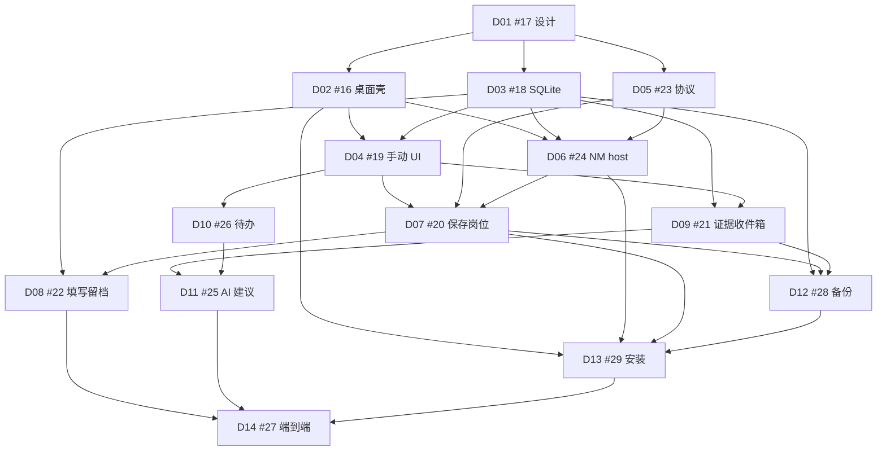

# 下游任务映射与决策清单

| 字段 | 值 |
| --- | --- |
| 标题 | D02–D14 如何消费 D01；定案 / 待选 / 待验证 |
| 作者 | D01 design PR |
| 日期 | 2026-09-06 |
| 状态 | Draft / Ready for review |
| 上级 | [README.md](README.md) · [D01 #17](https://github.com/TshyGO/resume-form-assistant-plugin/issues/17) · [Epic #15](https://github.com/TshyGO/resume-form-assistant-plugin/issues/15) |
| 并列 | [product-requirements.md](product-requirements.md) · [adr-architecture.md](adr-architecture.md) · [data-privacy.md](data-privacy.md) |

本文 **不改变** Epic 硬依赖图。发现的张力只记录建议，不静默改计划。D01 的实现就是文档 PR；D02+ 是后续 issue/PR。

---

## 1. 硬依赖图（保持原样）

来自 Epic #15 与规划 `map.json`：

**阶段出口**（Epic 标签，关闭一组 issue 的门）：

| 阶段 | 出口 |
| --- | --- |
| P0 | D01 决策确认 |
| P1 | D02–D04：离线手动管理申请 |
| P2 | D05–D07：插件能保存岗位并补传（含配对与 `submit.confirm`） |
| P3 | D08+D09：快照与回复证据 |
| P4 | D10+D11：待办与 AI 建议 |
| P5 | D12–D14：备份/安装/端到端 |

**执行波次**（谁可以先开工，硬依赖不变）：第一波 D01；第二波 D02、D03、D05 可并行；第三波 D04（等 D02+D03）、D06（等 D02+D03+D05）；第四波 D07（等 D04+D05+D06），D09/D10 在 D04 后分别推进。D04 **不是**与 D02 并行的阶段出口。

「可用 mock 提前开发」≠「依赖未验收就关闭 issue」。

---

## 2. D02–D14 消费映射

| 工作 | Issue | 硬依赖 | 从 D01 消费的结论 | 本 issue 仍需自己定的 |
| --- | --- | --- | --- | --- |
| D02 桌面壳、单实例、数据目录 | [#16](https://github.com/TshyGO/resume-form-assistant-plugin/issues/16) | D01 | **一个 Tauri GUI EXE**（后端=唯一写入者）+ 薄 host；mutex+named pipe；关窗隐藏≠退出；**idle 默认 15 min**（无窗口∧无 NM∧无备份/提醒）；无开机启动；日志脱敏；设置页展示真实路径；不可写则失败；「粘贴扩展 ID」设置入口骨架 | 窗口/托盘控件细节；15 min 是否做成设置项 |
| D03 SQLite 数据层 | [#18](https://github.com/TshyGO/resume-form-assistant-plugin/issues/18) | D01 | 逻辑对象含 AttachmentBlob 与折叠函数；无公司+URL 唯一约束；事件 append-only；`currentStage` 为 projected；恢复保留 `archiveId`、generation+1；幂等键；附件库外；`occurredAt` 在 unknown 时为 null | `CREATE TABLE`、索引、迁移、仓储 API |
| D04 无 AI 管理 UI | [#19](https://github.com/TshyGO/resume-form-assistant-plugin/issues/19) | D02、D03 | 阶段码含可过滤的 `filling`；桌面侧确认投递；文案「尚未导入回复证据」；两层候选的桌面版；走查 10.1–10.6 手动子集 | 布局、快捷键、空状态 |
| D05 协议契约 | [#23](https://github.com/TshyGO/resume-form-assistant-plugin/issues/23) | D01 | 冻结信封与应答 `{protocolVersion,correlationId,resultId?,ok,error?,payload}`；`messageType` 枚举含 `snapshot.chunk` 与 `outbox.reconcile`；64 KiB 业务信封；握手成功返回身份；generation 变化不失败握手 | JSON Schema、错误码表、分片帧字段、契约测试向量 |
| D06 NM host + 唯一写入者 | [#24](https://github.com/TshyGO/resume-form-assistant-plugin/issues/24) | D02、D03、D05 | 薄 host、stdio 纯净、扫描 argv 找 origin token（忽略 `--parent-window`）、按需 **启动 Tauri EXE**、pipe ACL、提交后应答、开发隔离脚本 | 可执行实现、argv 顺序 **待验证**、冷启动超时 |
| D07 保存岗位、配对、outbox、插件确认投递 | [#20](https://github.com/TshyGO/resume-form-assistant-plugin/issues/20) | D04、D05、D06 | 桌面粘贴 ID（非 NM 配对）；未安装/未配对 **无 durable 队列**；已配对未运行/离线才入队；两层候选；默认 `saved`；**插件 `submit.confirm` 归本 issue**；outbox 字段与 `clientInstanceId`；保留已有 storage key；SW 追加 NM 不得覆盖 `onClicked` | 退避参数、侧边栏文案打磨 |
| D08 快照与填写留档 | [#22](https://github.com/TshyGO/resume-form-assistant-plugin/issues/22) | D03、D07 | 默认仅元数据；`fill.submit` 不含字节；`snapshot.chunk`；>2 MiB 拒绝；三种「值」；失败/取消不改阶段 | 快照文件格式、字段值开关 |
| D09 证据收件箱 | [#21](https://github.com/TshyGO/resume-form-assistant-plugin/issues/21) | D03、D04 | `kind`=格式；`replyClass` 确认后才写；哈希警告不自动拆关联；导入≠改阶段 | MIME 解析、预览组件 |
| D10 待办与提醒 | [#26](https://github.com/TshyGO/resume-form-assistant-plugin/issues/26) | D04 | 日期精度；idle 15 min 内可提醒；无偷偷开机启动；SW 断开 ≠ 丢出盒 | 调度实现、夏令时测试 |
| D11 AI 建议 | [#25](https://github.com/TshyGO/resume-form-assistant-plugin/issues/25) | D09、D10 | 建议写入 `replyClass` 而非 `kind`；确认后同一事务；回执≠通过 | 提示词、OCR、支持矩阵 |
| D12 备份恢复回收 | [#28](https://github.com/TshyGO/resume-form-assistant-plugin/issues/28) | D03、D07、D09 | 不加密；新目录；**保留 archiveId、generation+1**；握手成功后暂停旧队列；回收 vs 永久删（refCount） | 归档格式、原子发布 |
| D13 安装升级 | [#29](https://github.com/TshyGO/resume-form-assistant-plugin/issues/29) | D02、D06、D07、D12 | NSIS-only；**双写 Edge+Chrome HKCU**，不靠 fallback；配对写当前 origin；卸载留数据 | NSIS hooks、SHA-256 |
| D14 端到端门禁 | [#27](https://github.com/TshyGO/resume-form-assistant-plugin/issues/27) | D08、D11、D13 | 含配对走查、插件确认投递、恢复+旧队列；真实 NM | 验收记录模板 |

### 2.1 依赖图上的张力（不改图，只提示阅读顺序）

1. **D08 硬依赖是 D03+D07，但信封上限与分片在 D05。** D05 处于更早波次（P2 vs P3），时间上会先存在。建议 D08 实现者把 D01+D05 当必读；不必把 D05 加进 D08 硬依赖以免打乱图。
2. **D12 硬依赖无 D05，但 generation 握手是协议。** D12 经 D07（依赖 D05）间接覆盖。恢复测试必须用真实握手，不能只改 DB 字段。
3. **D10「窗口关闭但后台运行」依赖 D02 进程模型。** 图上 D10 只依赖 D04。建议 D10 阅读 ADR；若托盘被否决，D10 须写明「关窗即无提醒」。
4. **Epic #15 与 D13 都把 MSI 交给 D01。** 本文建议 NSIS-only，与两者兼容，不是矛盾。
5. **D13「开发 ID 不稳定时的安全注册」与「D01 不加 key」。** 兼容：桌面粘贴 ID 写入当前 origin，不是通配，也不是改插件 `key`，更不是第一条 NM。
6. **插件「确认已投递」归 D07**（不改硬依赖）。D08 仍只做 fill/snapshot。D04 保留无插件路径的桌面确认。

未发现必须改依赖边的冲突。若负责人改选 Electron 或加 `key`，必须先改本 D01 与 D05，再动 D02/D07/D13。

---

## 3. 本次建议定案

负责人确认前视为「建议冻结」。确认后下游不得自行改成互不兼容的栈。

1. 桌面权威源；插件未装桌面时填写/模板/插件 AI 仍可用。
2. 十条产品规则（填写≠投递、回执≠通过、未导入≠未回信、UUID 身份、AI 只建议、队列幂等、不采集秘密、卸载不静默删、手动永远可用、v1 无邮箱/云/多平台）。
3. Stage 折叠函数（§6.2）；MVP **投影 `filling`**；`stage_corrected` 是普通 set-absolute。
4. 回复证据：`kind` 格式 vs `replyClass` 语义；`replyEvidenceState` 按 §6.3 从已关联已确认的 `replyClass` 投影（仅 auto_ack → auto_ack；任一人工作类 → human_reply；两者都有 → mixed；unknown/空不计）。
5. **两个 EXE**：Tauri GUI（后端=唯一写入者）+ `native-host.exe`。`data-service` 是库。禁止未鉴权 HTTP。禁止第三个常驻写入进程。
6. 同仓、插件留根目录。
7. Idle 默认 15 分钟（无窗口 ∧ 无 NM ∧ 无备份/提醒）。关窗 ≠ 退出。
8. 信封与 `messageType` 枚举；64 KiB 业务信封；`snapshot.chunk`；`outbox.reconcile`；握手成功返回身份。
9. D01/0.3.0 不加 `nativeMessaging`、不加 `key`。配对 = 桌面粘贴 ID；第一条 NM 不是配对。
10. Outbox 仅在已注册+已配对+协议 OK、**且用户已确认使用已有/新建并派发写入** 时持久化。handshake/候选查询是读，取消不入队。未安装/未配对无 durable 队列。
11. 恢复：保留 `archiveId`，generation 必 +1。
12. 插件 Key 留在扩展存储；桌面 Key 进 OS 凭据库。
13. 填写留档默认元数据；快照 ≤ 2 MiB。
14. NSIS per-user；D13 双写 Edge+Chrome HKCU。
15. 插件 `submit.confirm` 归 D07。两层候选。URL 裸 `code`/`key` 保留作岗位号。
16. 最低：Windows 10 22H2+ x64，Chrome/Edge 116+。

---

## 4. 需要项目负责人选择

只列真正要拍板的项。每项：推荐、理由、不选的代价。

### 4.1 Tauri 2 vs Electron

- **推荐：** Tauri 2 + Rust。
- **理由：** 唯一写入者与 NM host 本就要原生 EXE；Tauri 可共享 crate；NSIS per-user 对齐 D13；避免第二套 Node 与 `better-sqlite3` ABI。见 [ADR §3.1](adr-architecture.md#31-桌面栈tauri-2--rust-数据服务不用-electron)。
- **不选代价：** Electron 安装包大约 100MB+ 量级、native 模块重建、误暴露 fs 的风险更高。若选 Electron，D02/D03/D13 工作量与 ADR 整页作废，P1 推迟。

### 4.2 NSIS-only vs NSIS+MSI

- **推荐：** 仅 NSIS `setup.exe`。
- **理由：** 无管理员、装到 `%LOCALAPPDATA%`；求职者个人机是目标；MSI 需 WiX 且常 per-machine。
- **不选代价：** 双安装器测试矩阵（D13/D14）明显变大；`both` 模式会要管理员。企业需求出现再加 MSI，不挡首发。

### 4.3 托盘 + 后台 idle vs 关窗口即杀服务

- **推荐：** 关窗口隐藏到托盘；后端=唯一写入者继续跑；无窗口∧无 NM∧无备份/提醒后 **15 min** idle 退出；托盘含「打开」「退出」。
- **理由：** 写入者就是 GUI EXE，没有第三个 service。无托盘时用户以为已退出，任务管理器里仍有该 EXE。D06 主窗口未开仍要能保存岗位；D10 提醒依赖这段存活期。
- **不选代价：**
  - 关窗即杀：每次保存冷启动；关窗期间无提醒。
  - 无托盘但保持进程：无名 GUI 进程引发不信任，必须把「退出」做进设置页。

### 4.4 未打包扩展配对 vs 加 manifest `key`

- **推荐：** **不加 `key`**。桌面 UI **粘贴扩展 ID** 写入 per-user host manifest（Chrome / Edge 分开）。**第一条 NM 不是配对。** Chrome 重读时机 **待验证**。
- **理由：** NM 在 origin 进入 `allowed_origins` 之前根本不会启动 host，无法用 NM 引导配对。现网 ZIP 路径哈希 ID 不稳定；加 `key` 会孤儿化模板和 API Key。
- **不选代价：** 加 `key` 需 ID 迁移向导，越出 D01/D07。商店上架时再处理商店 ID。

### 4.5 填写留档默认仅元数据 vs 默认含字段值

- **推荐：** 默认仅元数据（计数、耗时、脱敏 URL、模板名、snapshot id）；字段值需显式打开。
- **理由：** 规则 7；字段值是 PII；默认关可降低备份敏感度。追溯「用了哪版简历」靠快照文件，不靠事件里的逐字段 JSON。
- **不选代价：** 默认含值会让 64 KiB 更容易被打满、备份全是简历正文、误采密码框的后果更重。

### 4.6 备份不加密 vs 加密

- **推荐：** MVP **不加密**，警告含 PII。
- **理由：** 加密要口令丢失策略、密钥存储、测试矩阵；宣传加密却口令写在旁边等于零。Epic 允许 D01 决定。
- **不选代价：** 做加密则 D12 范围膨胀，D14 必须测错口令/损坏密文；不做则用户把备份丢网盘会裸奔——用警告和「不要宣传加密」管理预期。

### 4.7 64 KiB 信封 vs 其他上限

- **推荐：** 双向 64 KiB JSON。
- **理由：** D05 原建议；远低于 Chrome host→浏览器 1 MB。业务信封只走元数据；快照字节走 `snapshot.chunk`（每块仍 ≤ 64 KiB）。
- **不选代价：** 提到 1 MB 会诱使把附件 base64 进 JSON。再缩小可能让候选列表过紧。改数字只在 D05 做，不改「文件不进业务信封」。

---

## 5. 需要后续原型验证

不得在无原型的情况下把下列写成「已实现事实」。失败则更新 D01/D05 与受影响 issue，而不是在实现 PR 里偷偷换模型。

| ID | 项 | 谁验证 | 失败时的后退 |
| --- | --- | --- | --- |
| V1 | named pipe + 单实例 mutex：第二 UI 只激活窗口；第二 host 不第二写入者 | D02、D06 | 改用 Tauri 单实例插件或锁文件，仍保持唯一写入者 |
| V2 | host 按需启动 **Tauri GUI EXE**（可隐藏、无控制台）、中文/空格路径、单实例互斥 | D06 | 禁止第三个 service；失败则文案「请先打开一次桌面」 |
| V3 | Chrome/Edge 更新 HKCU host manifest 的 `allowed_origins` 后，是否无需重启即可 `connectNative` | D06、D13 | 配对成功后提示「重新加载扩展或重启浏览器」 |
| V4 | MV3 service worker 与 `connectNative` 生命周期 | D07 | 以 `sendNativeMessage` 短连接 + outbox 为主路径 |
| V5 | 64 KiB 在真实 NM 栈上的拒绝行为（截断 vs 错误） | D05、D06 | 调整错误码；不提高业务上限去「试试能不能传附件」 |
| V6 | 部分 Windows 10 22H2 无 WebView2 时 NSIS bootstrapper | D13 | 文档改为手动安装 Runtime 链接 |
| V7 | ARM64 | D13 | 首发仅 x64 |
| V8 | idle 超时与仍有未完成备份/提醒的交互 | D02、D10、D12 | 有任务时推迟 idle；文档化 |

---

## 6. 本 D01 的 PR Plan

**本 issue 的唯一实现 = 文档 PR**（`docs/desktop-mvp/*`）。不提交 `/desktop` 源码、不改 `manifest.json`、不注册 NM、不碰 [`docs/ai-repeat-validation.md`](../ai-repeat-validation.md)。

建议 PR 标题：`docs(d01): freeze desktop MVP product and architecture baseline`。

关闭 #17 的条件：负责人在 PR 或 issue 中确认 §4 七项（或写下与推荐不同的选择）。未确认则下游只做可丢弃原型。

### 6.1 后续 PR / issue（现在不实现）

| 后续 | 预期产物 | 依赖 D01 的哪些冻结点 |
| --- | --- | --- |
| D02 | `/desktop` Tauri 壳（唯一写入者）、单实例、15 min idle、粘贴 ID 设置页骨架 | 两 EXE 拓扑、目录、托盘决议 |
| D03 | `data-service` **库**、折叠函数、AttachmentBlob、合成夹具 | 字段目录、幂等、archiveId 不变 |
| D04 | 申请列表/详情/时间线；桌面确认投递 | 阶段折叠、filling 过滤、两层候选 |
| D05 | `crates/protocol` Schema + 契约测试 | 信封、messageType、分片、reconcile |
| D06 | `native-host.exe` + 开发注册脚本 | origin 扫描、按需启动 GUI EXE |
| D07 | 插件 NM、粘贴 ID 配对、outbox、保存岗位、**确认已投递** | 未配对无队列、两层候选、storage key |
| D08 | `fill.submit` + `snapshot.chunk` | 2 MiB 上限、失败不改阶段 |
| D09 | 导入/预览/关联 | kind vs replyClass |
| D10 | 待办调度 | 15 min idle 内提醒 |
| D11 | 建议面板 + OS 凭据 | 写入 replyClass |
| D12 | 备份包 + 恢复向导 | 保留 archiveId、generation+1 |
| D13 | NSIS、**双写** HKCU、卸载留数据 | 不靠 Edge→Chrome fallback |
| D14 | 安装验收记录 | 配对 + 确认投递 + 恢复队列 |

每个后续 PR 必须写明「只完成 Dx 的哪一部分」，禁止一个大 PR 关闭整个 Epic。

---

## 7. Open Questions（汇总）

仅负责人项，细节在 §4。原型项在 §5，不占用负责人带宽。

若负责人否决推荐，更新顺序：本文件 + ADR 或产品需求中对应段落 → 评论 #17 → 再改下游 issue 正文。禁止只在实现里偏离。

---

## 8. References

- Epic: https://github.com/TshyGO/resume-form-assistant-plugin/issues/15
- D01: https://github.com/TshyGO/resume-form-assistant-plugin/issues/17
- D02 #16 · D03 #18 · D04 #19 · D05 #23 · D06 #24 · D07 #20 · D08 #22 · D09 #21 · D10 #26 · D11 #25 · D12 #28 · D13 #29 · D14 #27
- 规划对照：`output/playwright/desktop-planning/map.json`（仅内部创建记录，不是用户文档）
